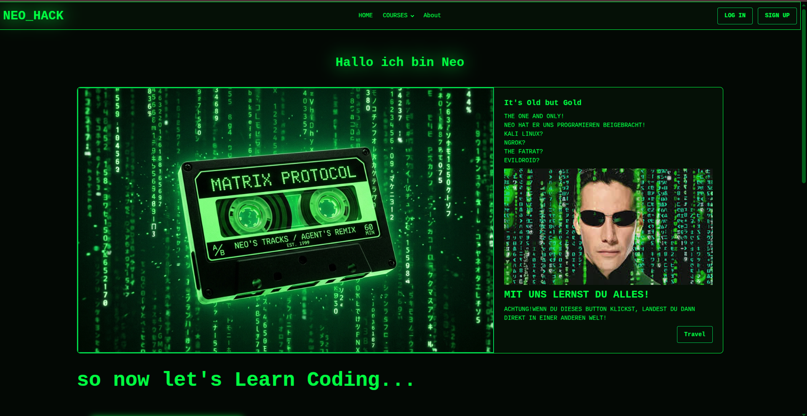
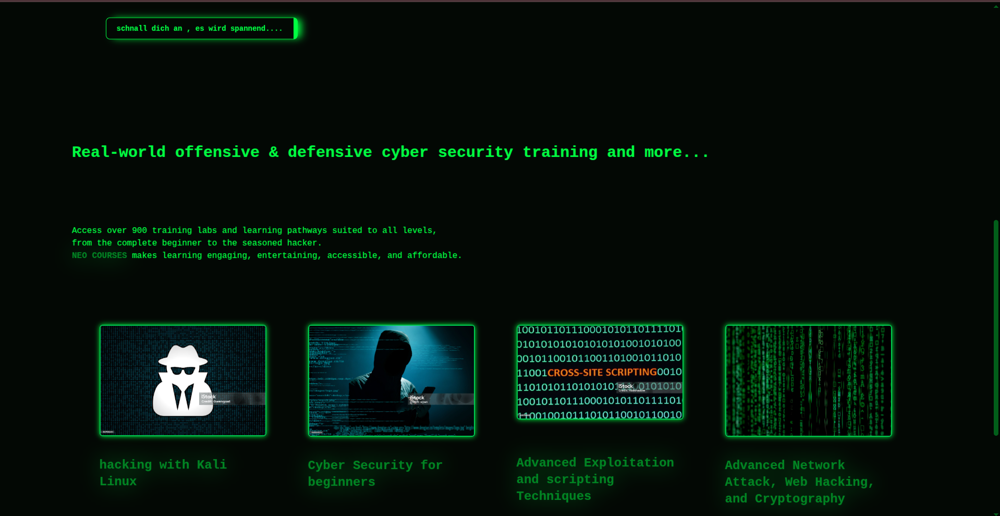
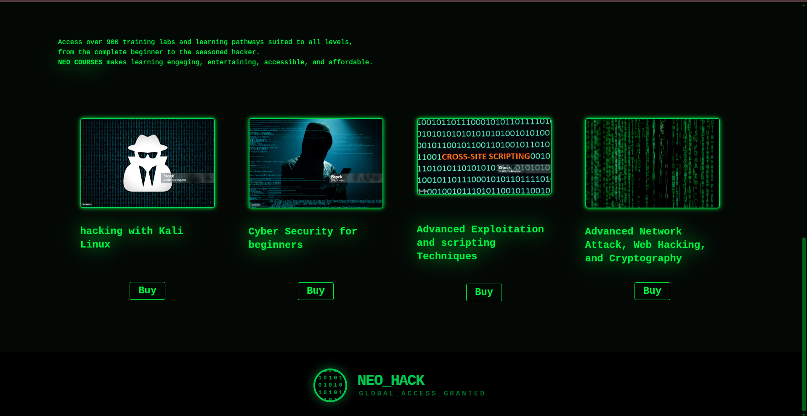

# NEO_HACK HACK THE WHOLE WORLD !

 A deep-dive into TAILWIND CSS and DAISYUI. This Project proves that complex, localized UIs can be built with a minimal code and maximum style.

 About The Project

 This repsitory demonstates the integration of modern front-end tooling to create high performance.
 1- Matrix Theming: A custom engineered dark theme utilizing OKLCH colors in Tailwind css to achieve high contrast "Matrix Green" glow effect with optimal accessibilty.
 2- Next GEN Tooling: Built with vite and tailwind css, for a modern devlopment workflow.

   Inspiration
   

   The inspiration behind "The Matrix Keyboard" was to move beyond standard UI patterns and explore how semantic color variables in DAISYUI can a high tech , immersive atmosphere.
   Instead of a typical light/dark toggle, the design aims to evoke the feeling of a digital simulation using deep "Void" blacks, vibrant "System Green" glows, and rich neon accents to highlight the "Code    & Culture" motto.

   Screenshots 
   
   Hero Section

   
   
   

   Courses
   
   
   

   Footer
   
   
   
